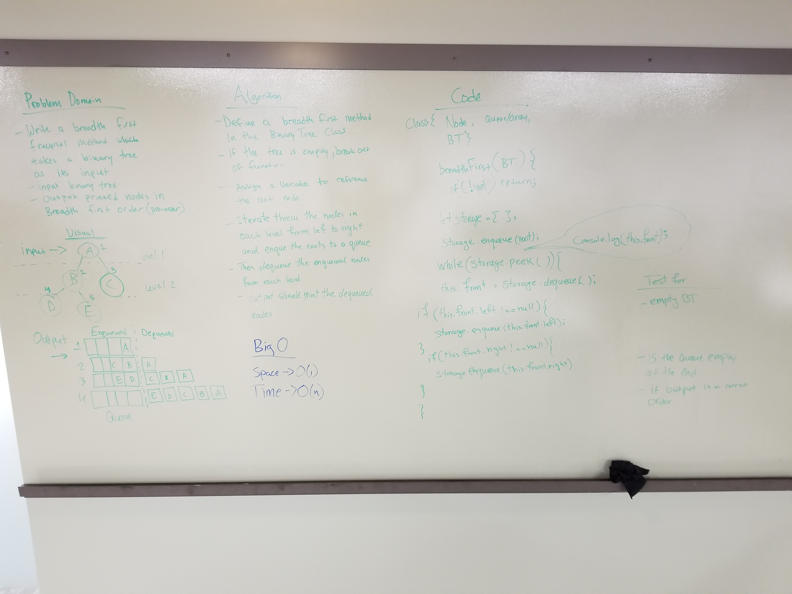

# Breadth-first
Traverse the tree and print all the nodes at each level before moving to a new level. 

## Challenge
Write a breadth first traversal method which takes a Binary Tree as its unique input and prints every visited node’s value.

## Approach & Efficiency
* Big O of time -> O(n) as we're using a while loop
* Big O of space -> O(1) as we're only printing the contents of the tree so the number of nodes in the tree to number of nodes printed is a 1:1 relationship.

## Solution

