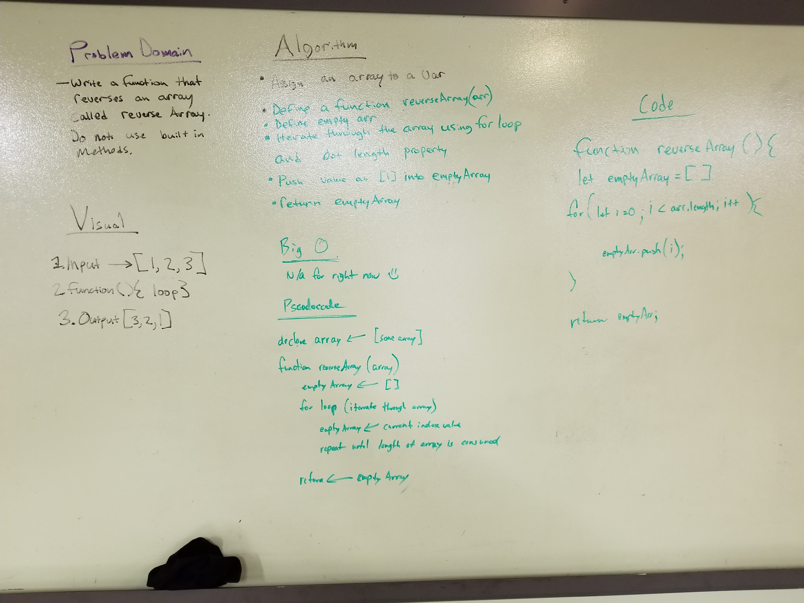

# DSA Challenge-01
Code Fellows 401 daily whiteboard code-challenge-01

## Challenge
The challenge was to write a function without using built in javascript methods to insert an input value into the middle of an array.

## Solution 
Iterate through the input array and copy its values into a new array. When the iterator reaches the half way point insert the input value to be added. 

## Team
Emery Parks
Ben Harris
