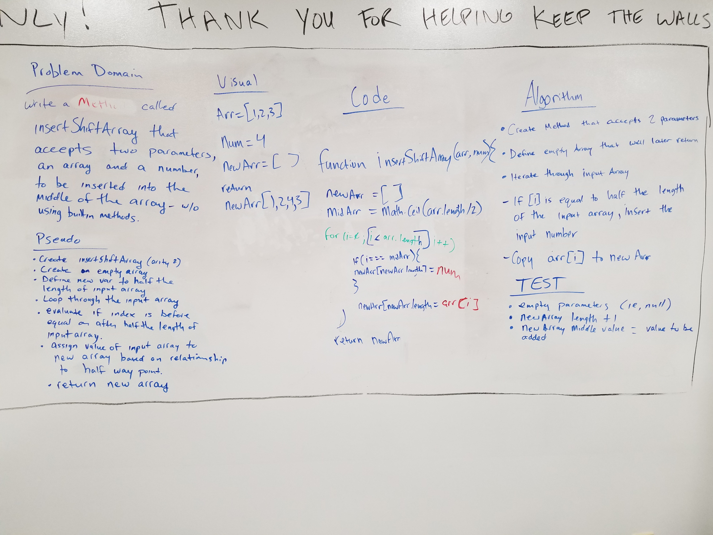

# DSA Challenge-02
CF 401 code-challenge-02

## Challenge
Write a function to insert an input value into the middle of an array without using built in JavaScript methods.

## Solution 
Iterate through the input array and copy its values into a new array. When the iterator reaches the half way point insert the input value to be added. 

## Team
Emery Parks,
David Chambers

