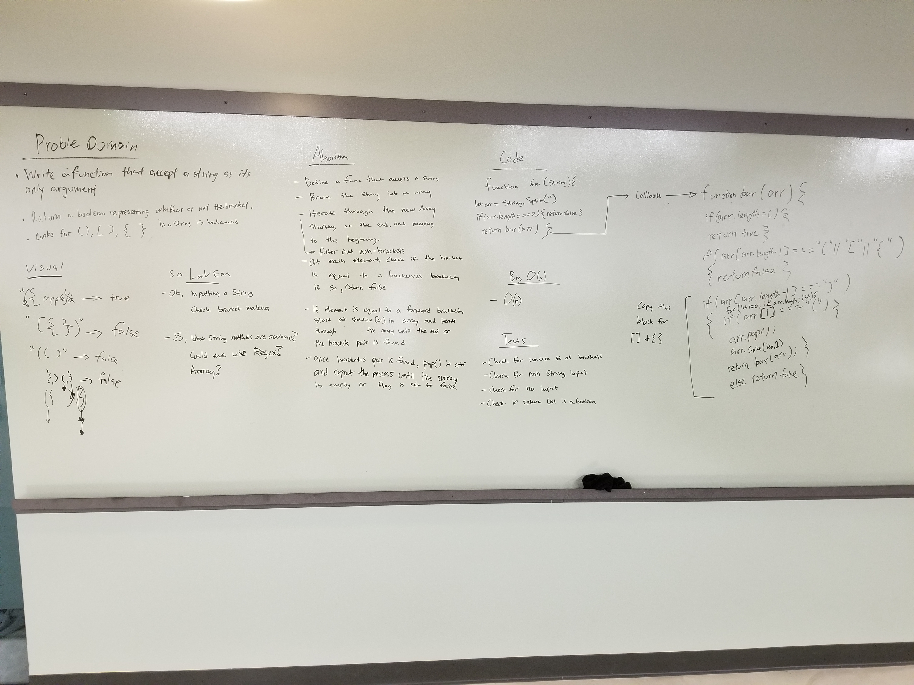

# Multi-bracket Validation

The function should take a string as its only argument, and should return a boolean representing whether or not the brackets in the string are balanced. There are 3 types of brackets:

* Round Brackets : ()
* Square Brackets : []
* Curly Brackets : {}

## Approach & Efficiency
Our approach was to split the string into an array. Next we used array methods and a recursive function with multiple if statements to validate whether or not each element in the array has a match. Our solution is an O(n) as we are iterating through the array to check for a matching bracket. 

## Solution

