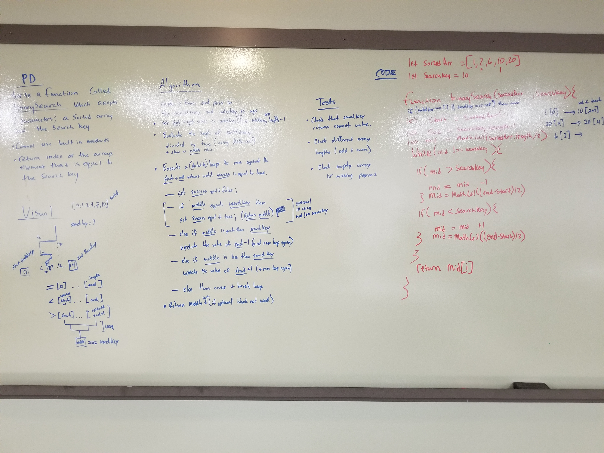

# data-structures-and-algorithms
CF 401 code-challenge-03

## Challenge
The challenge was to write a function without using built in javascript methods to find an arbitrary value in an array. 

## Solution 
Use a binary search algorithm to cut the array in half and search the halves until you have cut the array down to a point in which the searchKey is equal to the mid value of the array.

## Team
Emery Parks,
Ben Harris