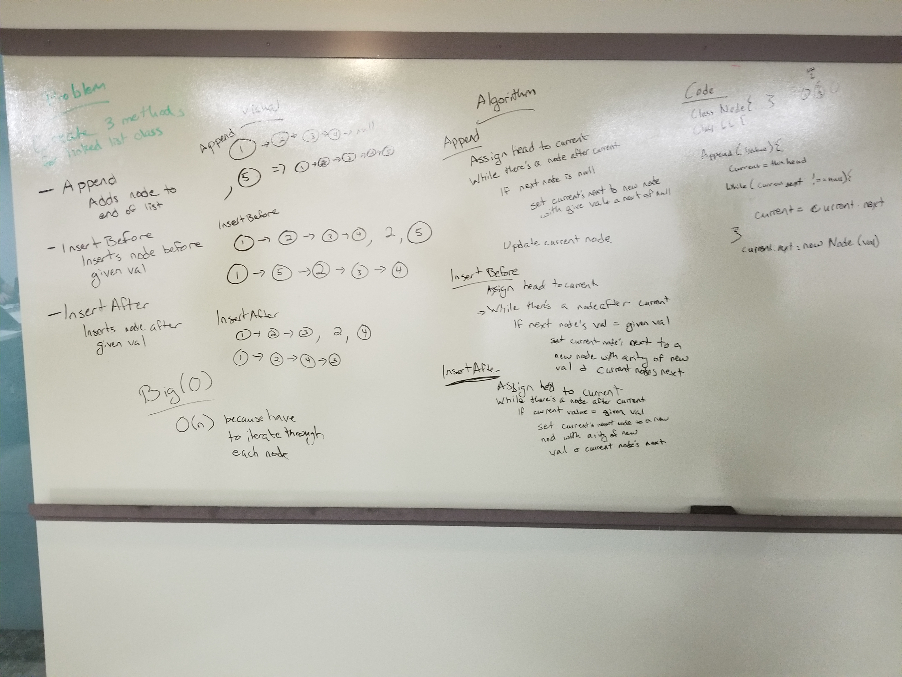

# Singly Linked List

## Challenge
Created methods to create singly linked lists. The methods include, `insert` to add values to a list, `includes` to check if the list includes a value, and `print` to print the contents of the list. `append` which adds the `value to add` to the end of the linked list.

## Solution 
Create a Node and LinkedList class that can be used to run methods against to easily reproduce new Nodes.

## API
* The `insert` method can be invoked by calling `sll.insert(<value to add>)` and it will prepend the value to add to the singly linked list
* The `includes` method can be invoked by calling `sll.includes(<value to find>)` and it will return a boolean suggesting whether or not the searched for value is included in the singly linked list.
* The `print` method can be invoked by calling `sll.print()` and it will print out the data value of all the links in the list in their order.
* The `append` method can be invoked by calling `sll.append(<val to append>)` and it will append the value to the Linked List.
* The `kthFromTheEnd` method can be invoked by running the tests with the Jest testing framework or calling `sll.kthFromTheEnd(<kth from the end value>)` in the `linked-list.js` file and running node `linked-list.js` from bash. The method will identify and return the value of the node that is in the position of kth from the end of the LinkedList. See solution image below for code-challenges-07 for visuals. 
* The `mergeLists` method will zip together two linked lists and return the reference to the head of the ziped list. Warning this method doesnt exist today but will in the future.

### Credits

https://codesandbox.io/s/kkqyy333o7

https://www.youtube.com/watch?v=MozZbtPyqt8

https://duckduckgo.com/?q=how+to+find+the+value+of+the+node+that+is+2+from+the+end+of+a+linked+list&atb=v135-7__&ia=qa&iax=qa 

Instructor JB

## Solution for code-challenges-06

Used the same code base from the previous labs and added the 1 new method to it. 2 new methods will be coming very shortly so stay tuned!

## Solution for code-challenge-07

Used the same code base from the previous labs and added the kth from the end method.

## Solution for code-challenge-08

Used the same code base from the previous labs and added the merge method. Didnt write the code for now but will add asap.

