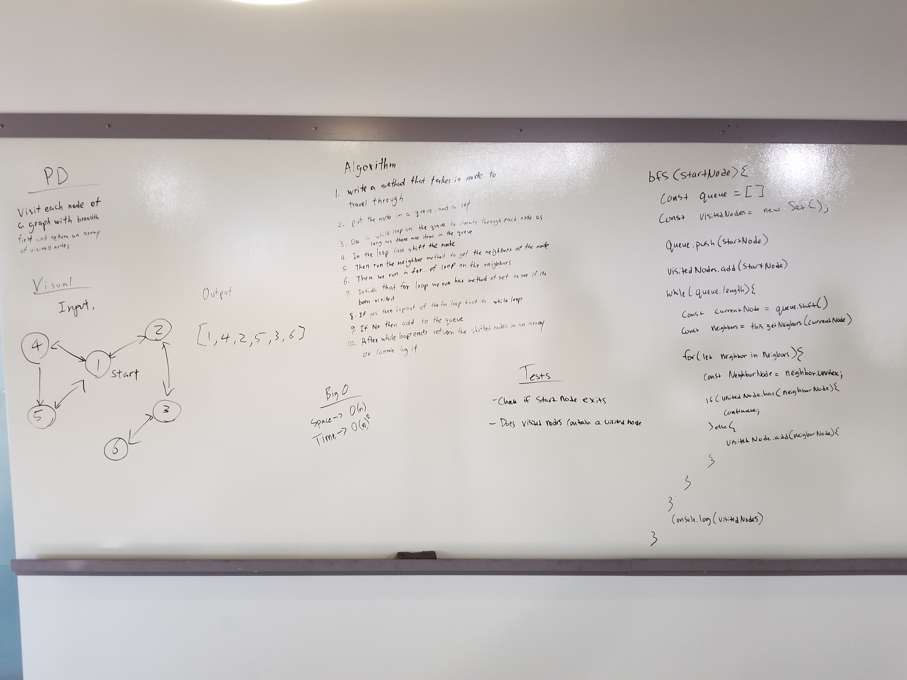
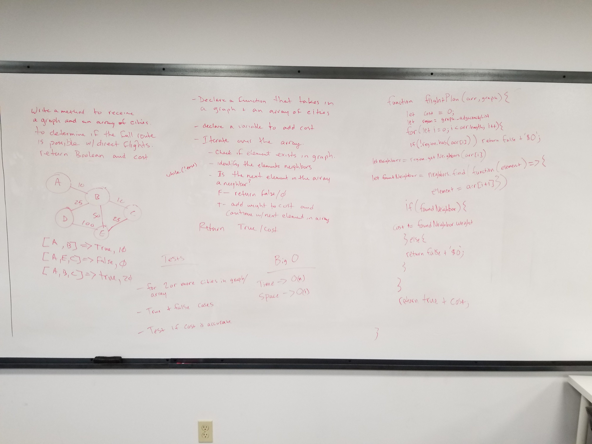

# Graphs
Used to store large amounts of multi-relational data

## Challenge
Write methods to work with a graph data structure

## Approach & Efficiency
A different approach was used with each different method.

## API
* `addVertex(<vertex>)` 
  * Will add a vertex to the graph but will not return any value.
* `addEdge(<startVertex, endVertex, weight>)`
  * Adds a new vertice to the graph
  * Includes the ability to have a “weight”
  * You'll need to bring in both the parent node(startVertex), and the new node(endVertex) to be added
* `getNeighbors(<vertex>)`
  * Returns a collection of nodes connected to the given node
  * Bring in a given node
  * Include the weight from the given node.
* `getNodes()` 
  * Is called on a graph and returns all of the nodes in the graph as a collection
* `size()`
  * Returns the total number of nodes in the graph
* `bfs()` traverses the graph in breadth first order and returns the collection of nodes in the order they were visited
* `getEdges(graph, array)` accepts a graph and an array as parameters. Will compare each element in the array with the immediate neighbors of a specified vertex and determine if the neighboring vertex includes the following element in the array. Will return a boolean and the total cost of the trip which adds the costs of each leg of the trip. This algorithm was created to solve for the following problem domain: 
  * Given a business trip itinerary, and an Alaska Airlines route map, is the trip possible with direct flights? If so, how much will the total trip cost be?
  * Write a function based on the specifications above, which takes in a graph, and an array of city names. Without utilizing any of the built-in methods available to your language, return whether the full trip is possible with direct flights, and how much it would cost.

## Testing
* Clone this repo to your local machine
* Run `npm install` from your cmd line
* Run `npm test` to view the test results

# Solutions

## Breadth First

## Get Edges

