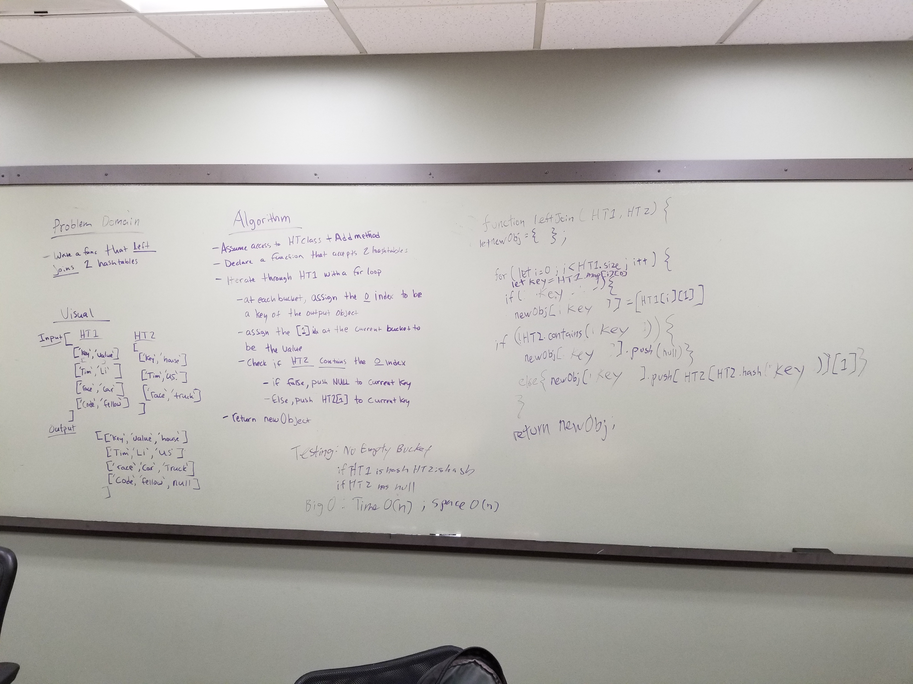

# Left join on 2 hashmaps
Implement a simplified LEFT JOIN for 2 Hashmaps.

## Challenge
* Write a function that LEFT JOINs two hashmaps into a single data structure.
* LEFT JOIN means all the values in the first hashmap are returned, and if values exist in the “right” hashmap, they are appended to the result row. If no values exist in the right hashmap, then some flavor of NULL should be appended to the result row.
* The returned data structure that holds the results is up to you. It doesn’t need to exactly match the output below, so long as it achieves the LEFT JOIN logic.

## Approach & Efficiency
* Big O time -> O(n)
* Big O space -> O(n)

## Solution
