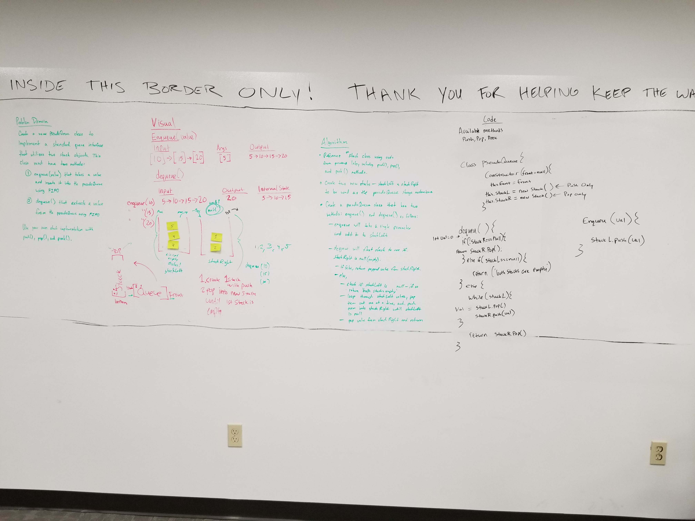

# Stacks and Queues
Methods used to construct, deconstruct and sneak peeks of stacks and queues with JS & NodeJS

## Challenge
Create a Stack class with the following methods, push, pop and peek. Create a Queue class with the following methods, enqueue, dequeue, and peek. Each method must have 3 tests to confirm it's integrity.

## Approach & Efficiency

My approach was to use a Node constructor and each time I pushed a Node to the Stack or Queue I would create a new node. My Stacks and Queues were stored/built on an array which allowed me to use the built in JS array methods. I used this approach because it seemed like a commonly used approach after briefly searching around for related examples on the internet. Using a linked list would have been a more efficient approach when considering time and space as the in the case of the Queue the array needs to reconstruct each time enqueue is invoked. I believe the Big O would be O(n). 

## API

### Methods:

#### Stacks
* `Push`: Adds a value to the top of the stack.
* `Pop`: Removes and returns the value from the top of the stack.
* `Peek`: Returns the value at the top of the stack, giving you a "peek".

#### Queue
* `Enqueue` Adds a value to the back of the queue.
* `Dequeeue` Removes a value from the front of the queue.
* `PeekQ` Returns the value at the front of the queue, giving you a "peek".

# 
# Queue with Stack
Manipulating a Stack so it functions the way a queue would function.

## Challenge
Create a brand new `PseudoQueue` class. Do not use an existing Queue. Instead, this `PseudoQueue` class will implement the standard queue interface, but will internally only utilize 2 Stack objects. Ensure that you create your class with the following methods: `enqueue` & `dequeue`. The `Stack` instances have only `push`, `pop` and `peek`.

## Solution

