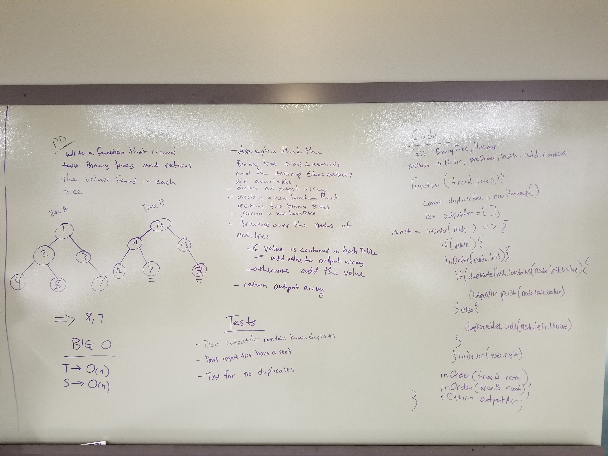

# Intersection of binary trees
Hashing binary trees

## Challenge
* Write a function called treeIntersection that takes two binary tree parameters.
* Without utilizing any of the built-in library methods available to your language, return a set of values found in both trees.

## Approach & Efficiency
* Big O time -> O(n)
* Big O space -> O(n)

## Solution
